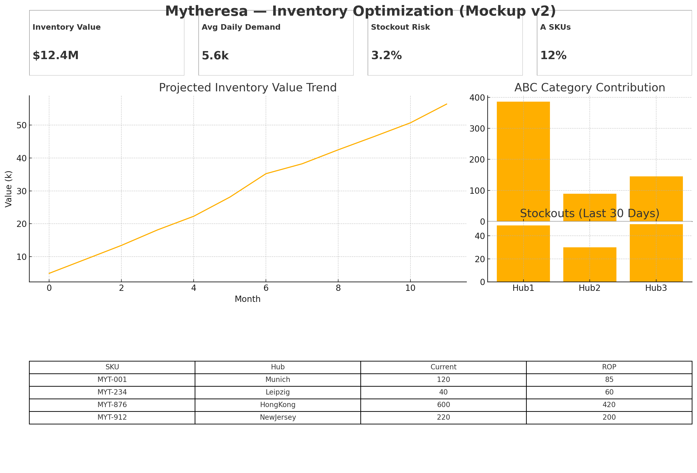
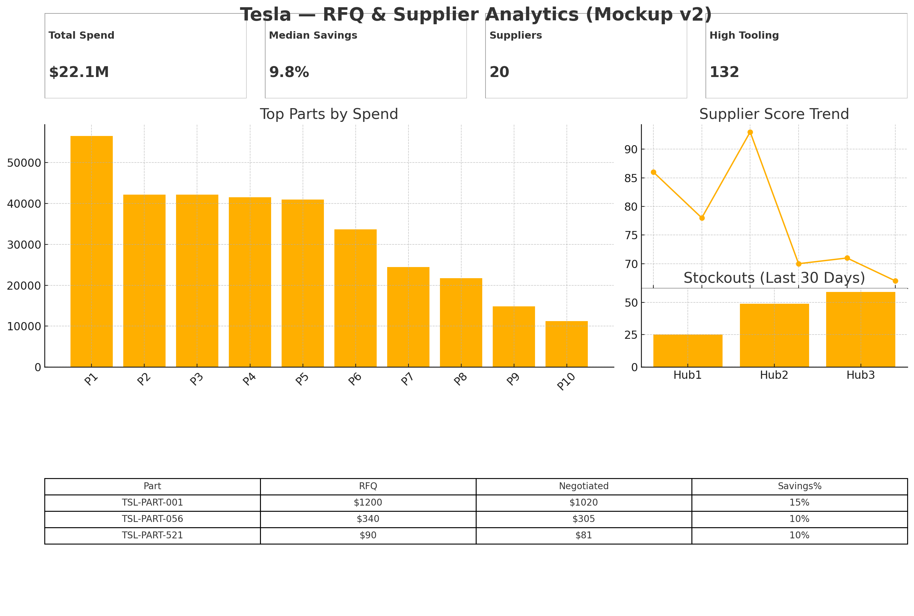
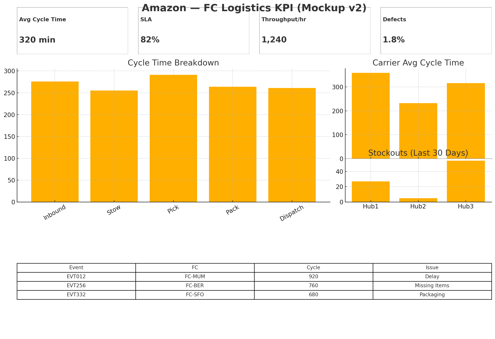

# Supply Chain Portfolio — Sandeep Dubey

> Recruiter-ready supply chain analytics portfolio (Mytheresa, Tesla, Amazon). Power BI dashboards, datasets, and notebooks.

**Live demo (GitHub Pages):** https://sandeepdubey0000-glitch.github.io/supply-chain-portfolio-sandeep-dubey/  *(enable Pages on branch `main` → /docs folder)*

---

## Contents
- [Mytheresa — Inventory Optimization](./Mytheresa-Inventory-Optimization/README.md)
- [Tesla — RFQ & Procurement Analytics](./Tesla-RFQ-Procurement-Analytics/README.md)
- [Amazon — FC Logistics KPI](./Amazon-FC-Logistics-KPIs/README.md)
- [PowerBI layouts & DAX](./powerbi_layouts/)
- [LinkedIn makeover assets](./linkedin_makeover/)

---

## Quick summary
- **Tools:** Power BI, SAP S/4HANA concepts, Python, Excel  
- **Datasets:** realistic synthetic CSVs for each project (ready to load)  
- **Objective:** showcase supply chain domain + analytics skills for hiring managers and recruiters

---

## How to run
1. `git clone https://github.com/sandeepdubey0000-glitch/supply-chain-portfolio-sandeep-dubey`  
2. Open each project folder and load the CSV into Power BI / Python notebooks.  
3. Follow the README in each project to reproduce results.  

---

## Key achievements (highlights to show recruiters)
- **15% cost reduction** simulated through RFQ negotiations (Tesla sample)  
- **98% fulfillment accuracy** for prioritized SKUs (Mytheresa sample)  
- **Improved FC visibility**: average cycle time ~320 min & SLA 82% (Amazon sample)

---

## Project previews

  
  
  

---

## Contact

GitHub: https://github.com/sandeepdubey0000-glitch/supply-chain-portfolio-sandeep-dubey  
LinkedIn: https://www.linkedin.com/in/sandeep-dubey-25jul  
Email: sandeepdubey0000@gmail.com

---

## License
This repository is available under the MIT License. See [LICENSE](./LICENSE) for details.
